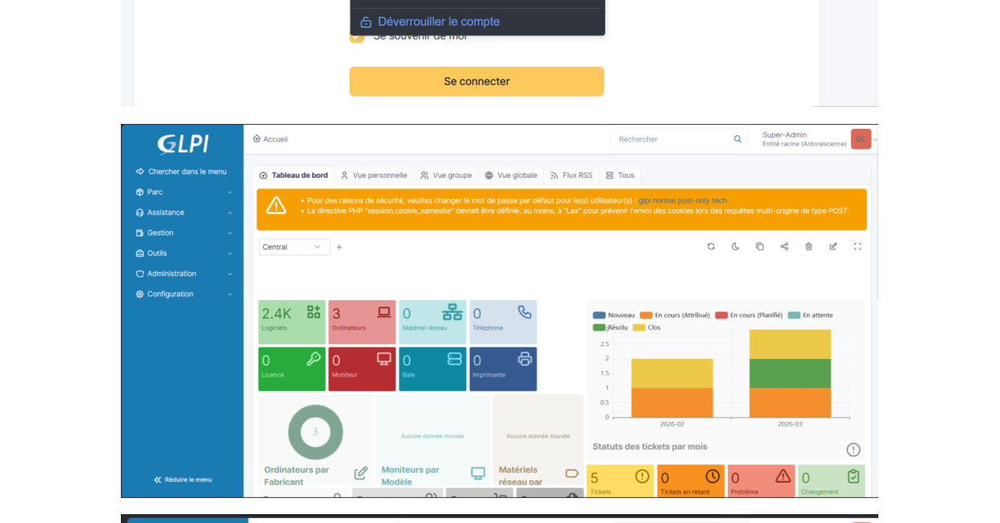
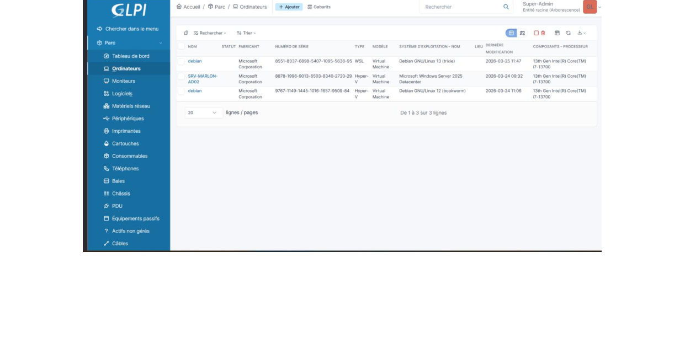
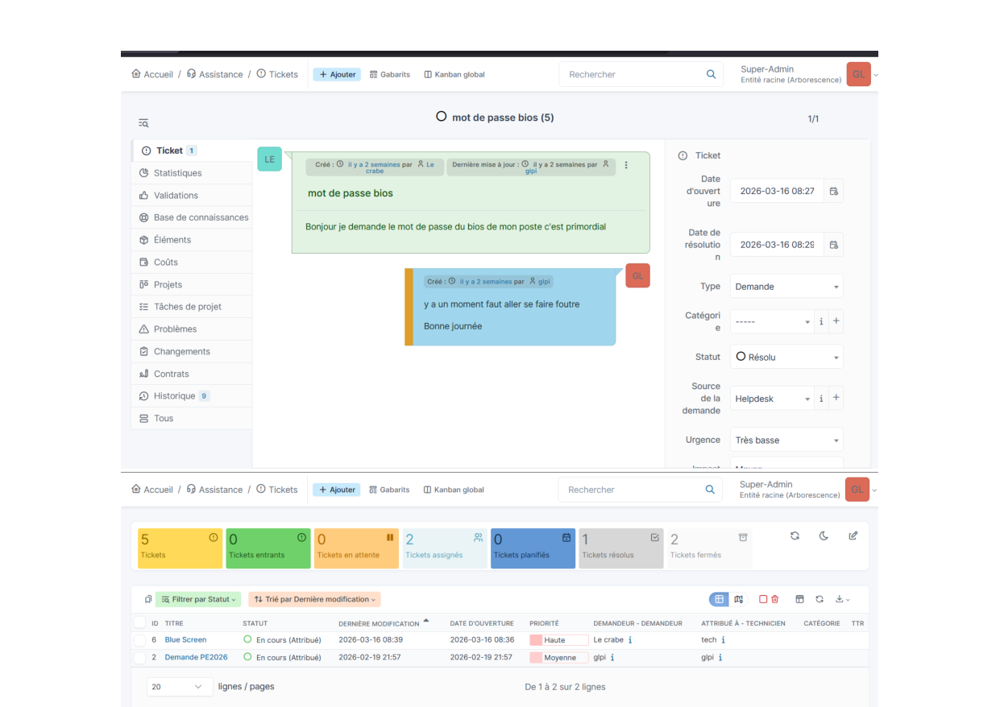

# 🖥️ GLPI — Gestion Libre de Parc Informatique

> **BTS SIO · SISR · Documentation complète 2025**
> `GLPI 11` · `Debian 13` · `PHP 8.4` · `MariaDB` · `Apache 2.4`

---

## 📋 Sommaire

- [Partie 1 - La gestion de parc informatique](#partie-1---la-gestion-de-parc-informatique)
  - [1.1 Composition d'un parc informatique](#11-composition-dun-parc-informatique)
  - [1.2 Inventaire et suivi du parc](#12-inventaire-et-suivi-du-parc)
  - [1.3 Le referentiel ITIL](#13-le-referentiel-itil)
- [Partie 2 - Demarche qualite et referentiels](#partie-2---demarche-qualite-et-referentiels)
  - [2.1 Definition d'une demarche qualite](#21-definition-dune-demarche-qualite)
  - [2.2 ITIL](#22-itil---information-technology-infrastructure-library)
  - [2.3 COBIT](#23-cobit---control-objectives-for-it)
  - [2.4 CMMI](#24-cmmi---capability-maturity-model-integration)
  - [2.5 ISO 27001](#25-iso-27001---securite-de-linformation)
- [Partie 3 - Le logiciel GLPI](#partie-3---le-logiciel-glpi)
  - [3.1 Presentation de GLPI](#31-presentation-de-glpi)
  - [3.2 Fonctionnalites de l'agent GLPI](#32-fonctionnalites-de-lagent-glpi)
  - [3.3 Valeur ajoutee du serveur GLPI](#33-valeur-ajoutee-du-serveur-glpi)
- [Partie 4 - Installation du serveur GLPI](#partie-4---installation-du-serveur-glpi)
  - [4.1 Mise a jour du systeme](#41-mise-a-jour-du-systeme)
  - [4.2 Extensions PHP 8.4](#42-installation-des-extensions-php-84)
  - [4.3 Securisation de MariaDB](#43-securisation-de-mariadb)
  - [4.4 Creation de la base de donnees](#44-creation-de-la-base-de-donnees)
  - [4.5 Telechargement de GLPI 11](#45-telechargement-et-decompression-de-glpi-11)
  - [4.6 Repertoires et permissions](#46-organisation-des-repertoires-et-permissions)
  - [4.7 VirtualHost Apache](#47-configuration-du-virtualhost-apache)
  - [4.8 Configuration web](#48-configuration-via-linterface-web)
- [Partie 5 - Agent sur Debian](#partie-5---installation-de-lagent-sur-debian)
  - [5.1 Telechargement](#51-telechargement-de-linstalleur)
  - [5.2 Execution de l'installeur](#52-execution-de-linstalleur)
  - [5.3 Activation du service](#53-activation-et-demarrage-du-service)
  - [5.4 Verification](#54-verification-du-fichier-de-configuration)
- [Partie 6 - Agent sur Windows](#partie-6---installation-de-lagent-sur-windows)
  - [6.1 Telechargement](#61-telechargement)
  - [6.2 Installation graphique](#62-installation-graphique-methode-simple)
  - [6.3 Installation silencieuse](#63-installation-silencieuse-ligne-de-commande)
  - [6.4 Installation via Winget](#64-installation-via-winget)
  - [6.5 Verification du service](#65-verification-du-service)
- [Partie 7 - Tests et validation](#partie-7---tests-et-validation)
  - [7.1 Test 1 - Accessibilite du serveur](#71-test-1---accessibilite-du-serveur-glpi)
  - [7.2 Test 2 - Inventaire Debian](#72-test-2---forcer-un-inventaire-depuis-debian)
  - [7.3 Test 3 - Inventaire Windows](#73-test-3---forcer-un-inventaire-depuis-windows)
  - [7.4 Test 4 - Verification dans GLPI](#74-test-4---verifier-linventaire-dans-glpi)
  - [7.5 Test 5 - Inventaire natif](#75-test-5---activer-linventaire-natif-glpi)
  - [7.6 Checklist securite](#76-checklist-de-securite-post-installation)
- [Partie 8 - Gestion des incidents Helpdesk](#partie-8---gestion-des-incidents-helpdesk)
  - [8.1 Creer un utilisateur normal](#81-creer-un-utilisateur-de-type-normal)
  - [8.2 Creer un ticket d'incident](#82-creer-un-ticket-dincident)
  - [8.3 Creer un utilisateur technicien](#83-creer-un-utilisateur-technicien)
  - [8.4 Suivi et cloture du ticket](#84-suivi-et-cloture-du-ticket)
- [Partie 9 - Style de rédaction et bonnes pratiques documentaires](#partie-9---style-de-rédaction-et-bonnes-pratiques-documentaires)
  - [9.1 Principes généraux](#91-principes-généraux)
  - [9.2 Formatage du texte](#92-formatage-du-texte)
  - [9.3 Blocs de code](#93-blocs-de-code)
  - [9.4 Tableaux](#94-tableaux)
  - [9.5 Listes et puces](#95-listes-et-puces)
  - [9.6 Alertes et encadrés](#96-alertes-et-encadrés)
  - [9.7 Liens et références](#97-liens-et-références)

---

## Partie 1 - La gestion de parc informatique

### 1.1 Composition d'un parc informatique

Le parc informatique d'une organisation est un assemblage, parfois hétéroclite, de matériels et de logiciels accumulés tout au long des années.

| Catégorie | Exemples |
|-----------|----------|
| **Matériel (hardware)** | Ordinateurs fixes/portables, serveurs, imprimantes, scanners, smartphones, switchs, routeurs, bornes Wi-Fi |
| **Logiciels (software)** | Systèmes d'exploitation, suites bureautiques, logiciels métiers, antivirus, outils de supervision, licences |
| **Réseau & télécoms** | Câblage, commutateurs, routeurs, DSLAM, systèmes téléphoniques VoIP |
| **Infrastructure physique** | Baies serveurs, onduleurs, climatisation salle serveurs, systèmes de sauvegarde |
| **Ressources documentaires** | Contrats de maintenance, garanties, documentations techniques, certificats de licences |

---

### 1.2 Inventaire et suivi du parc

La gestion du parc informatique recouvre la fonction d'inventaire des éléments mais aussi le suivi et l'évolution :

- 📦 Inventaire complet du matériel et des logiciels installés sur chaque poste
- 📄 Suivi des licences logicielles et vérification de leur conformité
- 🛡️ Gestion des garanties, contrats de maintenance et dates d'expiration
- 📍 Suivi de la localisation physique de chaque équipement
- 🔄 Gestion du cycle de vie du matériel (achat → utilisation → renouvellement → rebut)
- 🔧 Suivi des mises à jour système et des correctifs de sécurité (patching)
- 🔐 Gestion des droits d'accès, des comptes utilisateurs et des habilitations
- 📅 Planification des renouvellements matériels à court et moyen terme
- 💶 Suivi financier et comptable (valeur d'achat, amortissement)
- 🎫 Gestion des incidents, tickets d'assistance et demandes utilisateurs (helpdesk)
- 📈 Analyse des besoins et planification des évolutions du système d'information

> 💡 **Exemples de questions auxquelles répond la gestion de parc :**
> Quelles versions de Windows sont installées et sur quels postes ? Y a-t-il des disques proches de la saturation ? Quels postes sont encore sous garantie ? Combien de machines à renouveler dans 2 ans ?

---

### 1.3 Le referentiel ITIL

La tendance actuelle des DSI est l'adoption d'un référentiel commun de bonnes pratiques.
**ITIL (Information Technology Infrastructure Library)** est le référentiel majoritairement adopté ; il couvre les métiers de la production informatique et du support.

---

## Partie 2 - Demarche qualite et referentiels

### 2.1 Definition d'une demarche qualite

Une **démarche qualité** est un ensemble structuré de méthodes, processus et outils mis en place par une organisation pour garantir que ses produits, services et processus répondent à des exigences définies et s'améliorent continuellement.

Elle repose sur le **cycle PDCA de Deming** :

```
Plan → Do → Check → Act
  ↑________________________↓
```

Dans la gestion des incidents informatiques, une démarche qualité vise à :
- Réduire les temps de résolution
- Améliorer la satisfaction des utilisateurs
- Prévenir la réapparition des incidents

---

### 2.2 ITIL - Information Technology Infrastructure Library

**ITIL** est le référentiel de bonnes pratiques IT le plus utilisé au monde. Il structure la gestion des services informatiques en processus clairs.

Cycle de gestion des incidents selon ITIL :

```
Détection → Enregistrement → Classification → Priorisation
    → Diagnostic → Résolution → Clôture
```

| ✅ Forces | 🔗 Lien avec GLPI |
|-----------|------------------|
| Très complet et reconnu mondialement | GLPI implémente les recommandations ITIL |
| Aligné sur les besoins métier | Tickets, SLA, CMDB intégrée |
| Processus structurés et mesurables | Helpdesk conforme aux bonnes pratiques |

---

### 2.3 COBIT - Control Objectives for IT

**COBIT** est un cadre de gouvernance IT développé par l'ISACA. Il aligne la DSI sur les objectifs stratégiques de l'entreprise et fournit des métriques pour mesurer la performance des processus IT.

- Traçabilité et conformité des réponses aux incidents
- Alignement métier / IT
- Gestion des risques informatiques

---

### 2.4 CMMI - Capability Maturity Model Integration

**CMMI** évalue et améliore la maturité des processus sur une échelle de **1 à 5** :

| Niveau | Nom | Description |
|--------|-----|-------------|
| 1 | Initial | Processus chaotiques, non définis |
| 2 | Géré | Processus planifiés et suivis |
| 3 | Défini | Processus standardisés à l'organisation |
| 4 | Géré quantitativement | Processus mesurés et contrôlés |
| 5 | En optimisation | Amélioration continue et innovation |

---

### 2.5 ISO 27001 - Securite de l'information

La norme **ISO 27001** définit les exigences pour un Système de Management de la Sécurité de l'Information (SMSI).

Elle impose de gérer les incidents de sécurité de façon structurée :

```
Identification → Classification → Réponse → Documentation → Retour d'expérience
```

> ℹ️ ISO 27001 est complémentaire à ITIL pour les incidents liés à la cybersécurité.

---

## Partie 3 - Le logiciel GLPI

### 3.1 Presentation de GLPI

**GLPI** (Gestion Libre de Parc Informatique) est un logiciel open source français de gestion de parc informatique et de service desk. Il implémente les bonnes pratiques ITIL.

| Propriété | Valeur |
|-----------|--------|
| **Version actuelle** | GLPI 11.0.x (octobre 2025) |
| **Licence** | GNU GPL v2 — gratuit et open source |
| **Technologies** | PHP 8.4, MariaDB/MySQL, Apache 2.4 |
| **OS serveur** | Debian 13 Trixie (recommandé) |
| **Site officiel** | https://glpi-project.org |

---

### 3.2 Fonctionnalites de l'agent GLPI

L'agent GLPI est un outil de collecte automatisée installé sur chaque poste client. Il permet :

- 🔍 **Inventaire automatique** — collecte CPU, RAM, disques, OS, logiciels installés, adresses MAC/IP
- 🔔 **Détection des changements** — surveillance en continu des modifications de configuration
- 🌐 **Découverte réseau** — scan du LAN pour détecter imprimantes, switchs, NAS
- 🔄 **Synchronisation automatique** — envoi vers GLPI selon une fréquence configurable (défaut : 24h)

---

### 3.3 Valeur ajoutee du serveur GLPI

Le serveur GLPI centralise toutes les données remontées par les agents :

- 🖥️ Interface de gestion complète de tous les éléments du parc
- 💰 Gestion comptable et financière (valeur, amortissement, garanties)
- 🎫 Module Helpdesk complet (tickets, SLA, clôture)
- 🗄️ CMDB intégrée pour tracer les relations entre équipements
- 📊 Tableaux de bord et rapports statistiques

---

## Partie 4 - Installation du serveur GLPI

> ⚠️ **Prérequis :** Debian 13 Trixie · PHP 8.2 minimum (8.4 recommandé) · MariaDB 10.6+ · Apache 2.4
> Ces commandes sont validées pour **GLPI 11** en 2025.

```
[1] Mise à jour  →  [2] Socle LAMP  →  [3] Extensions PHP
     →  [4] Base de données  →  [5] Téléchargement GLPI
          →  [6] Permissions & VirtualHost  →  [7] Config navigateur
```

---

### 4.1 Mise a jour du systeme

```bash
apt update && apt upgrade -y
apt install apache2 mariadb-server php php-fpm -y
systemctl enable apache2 mariadb && systemctl start apache2 mariadb
```

---

### 4.2 Installation des extensions PHP 8.4

```bash
apt install php8.4-mysqli php8.4-mbstring php8.4-curl php8.4-gd \
        php8.4-simplexml php8.4-xml php8.4-intl php8.4-zip \
        php8.4-bz2 php8.4-ldap php8.4-apcu php8.4-xmlrpc -y
```

---

### 4.3 Securisation de MariaDB

```bash
mariadb-secure-installation
```

> 💡 Répondre **Oui** à toutes les questions : définir un mot de passe root fort, supprimer les utilisateurs anonymes, désactiver l'accès root distant, supprimer la base de test.

---

### 4.4 Creation de la base de donnees

```sql
mariadb -u root -p

CREATE DATABASE glpi CHARACTER SET utf8mb4 COLLATE utf8mb4_unicode_ci;
CREATE USER 'glpiuser'@'localhost' IDENTIFIED BY 'mdpglpi';
GRANT ALL PRIVILEGES ON glpi.* TO 'glpiuser'@'localhost';
FLUSH PRIVILEGES;
EXIT;
```

---

### 4.5 Telechargement et decompression de GLPI 11

```bash
cd /tmp
wget https://github.com/glpi-project/glpi/releases/download/11.0.4/glpi-11.0.4.tgz
tar xzf glpi-11.0.4.tgz -C /var/www/
```

> ℹ️ Vérifiez la dernière version sur : https://github.com/glpi-project/glpi/releases

---

### 4.6 Organisation des repertoires et permissions

```bash
chown -R www-data:www-data /var/www/glpi
chmod -R 775 /var/www/glpi

# Securite : deplacer config/files/logs hors de la racine web
mkdir /etc/glpi       && chown www-data /etc/glpi
mv /var/www/glpi/config /etc/glpi

mkdir /var/lib/glpi   && chown www-data /var/lib/glpi
mv /var/www/glpi/files /var/lib/glpi

mkdir /var/log/glpi   && chown www-data /var/log/glpi
```

---

### 4.7 Configuration du VirtualHost Apache

```bash
nano /etc/apache2/sites-available/glpi.conf
```

```apache
<VirtualHost *:80>
    ServerName glpi.local
    DocumentRoot /var/www/glpi/public

    <Directory /var/www/glpi/public>
        Require all granted
        AllowOverride All
        RewriteEngine On
        RewriteCond %{REQUEST_FILENAME} !-f
        RewriteRule ^(.*)$ index.php [QSA,L]
    </Directory>
</VirtualHost>
```

```bash
a2enmod rewrite
a2ensite glpi.conf
a2dissite 000-default.conf
systemctl restart apache2
```

---

### 4.8 Configuration via l'interface web

1. Ouvrir un navigateur : `http://@IpServeurGLPI`
2. Choisir la langue : **Français**
3. Accepter la licence et cliquer sur **Installer**
4. Paramètres BDD : `localhost` / `glpiuser` / `mdpglpi` — sélectionner `glpi`
5. Finaliser et cliquer sur **Utiliser GLPI**

**Comptes par défaut :**

| Identifiant | Mot de passe | Rôle |
|-------------|-------------|------|
| `glpi` | `glpi` | Administrateur |
| `tech` | `tech` | Technicien |
| `normal` | `normal` | Utilisateur normal |
| `post-only` | `postonly` | Post-only |

> ⚠️ **Sécurité obligatoire après installation :**
> ```bash
> rm -rf /var/www/glpi/install
> ```
> Changer immédiatement tous les mots de passe par défaut !

**Capture d'écran — Page de connexion GLPI :**


*Page de connexion GLPI 11 — saisir l'identifiant et le mot de passe pour accéder à l'interface.*

---

## Partie 5 - Installation de l'agent sur Debian

> ℹ️ Ces commandes sont à exécuter sur le poste **CLIENT** Debian, pas sur le serveur GLPI.

### 5.1 Telechargement de l'installeur

```bash
cd /tmp
wget https://github.com/glpi-project/glpi-agent/releases/latest/download/glpi-agent-linux-installer.pl
```

> Vérifier la dernière version sur : https://github.com/glpi-project/glpi-agent/releases

---

### 5.2 Execution de l'installeur

```bash
perl glpi-agent-linux-installer.pl \
  --type=typical \
  --server=http://@IpServeurGLPI \
  --no-ssl-check
```

> 💡 Remplacer `@IpServeurGLPI` par l'adresse IP réelle. Ajouter `--tag=NomPoste` pour identifier la machine.

---

### 5.3 Activation et demarrage du service

```bash
systemctl enable glpi-agent
systemctl start glpi-agent
systemctl status glpi-agent
```

---

### 5.4 Verification du fichier de configuration

```bash
cat /etc/glpi-agent/agent.cfg
```

> Vérifier que la ligne `server =` pointe bien vers l'adresse du serveur GLPI.

---

## Partie 6 - Installation de l'agent sur Windows

> ⚠️ L'installation requiert des **droits administrateur**. Agent disponible en 64 bits depuis la version 1.8.

### 6.1 Telechargement

Se rendre sur https://github.com/glpi-project/glpi-agent/releases et télécharger le fichier `.msi` 64 bits.

Exemple : `GLPI-Agent-1.16-x64.msi`

---

### 6.2 Installation graphique methode simple

1. Double-cliquer sur le fichier `.msi` et accepter l'élévation UAC
2. Choisir le type d'installation : **Typical**
3. Dans **Remote Targets (GLPI Server URL)**, saisir : `http://@IpServeurGLPI`
4. Cliquer sur **Install** puis **Finish**

---

### 6.3 Installation silencieuse ligne de commande

```cmd
msiexec /i GLPI-Agent-1.16-x64.msi /quiet ^
  SERVER=http://@IpServeurGLPI ^
  RUNNOW=1
```

> 💡 `RUNNOW=1` force un inventaire immédiat après l'installation. Idéal pour un déploiement **GPO**.

---

### 6.4 Installation via Winget

```powershell
winget install glpi-project.glpi-agent
```

---

### 6.5 Verification du service

Dans `services.msc`, vérifier que le service **GLPI Agent** est :
- État : `Démarré`
- Type de démarrage : `Automatique`

---

## Partie 7 - Tests et validation

> ✅ **Objectif :** valider que chaque composant fonctionne correctement avant de passer en production.

```
[Test 1] Serveur web
    ↓
[Test 2] Agent Debian  →  inventaire forcé
    ↓
[Test 3] Agent Windows  →  inventaire forcé
    ↓
[Test 4] Verification dans GLPI  →  Parc > Ordinateurs
    ↓
[Test 5] Helpdesk  →  ticket créé, suivi, clôturé
    ↓
✅ Installation validée
```

---

### 7.1 Test 1 - Accessibilite du serveur GLPI

```bash
# Ouvrir dans un navigateur
http://@IpServeurGLPI

# Verifier les services sur le serveur
systemctl status apache2
systemctl status mariadb
```

> ✅ Les deux services doivent être en état `active (running)`.

---

### 7.2 Test 2 - Forcer un inventaire depuis Debian

```bash
# Forcer une remontee immediate
glpi-agent --force

# Consulter les logs
journalctl -u glpi-agent -n 50 --no-pager
```

> Chercher la ligne : `Inventory sent successfully` ou `New Inventory from [NomDuPoste]`

---

### 7.3 Test 3 - Forcer un inventaire depuis Windows

**Méthode 1 — Via le navigateur (la plus simple)**

```
http://localhost:62354/now
```

> La page affiche `OK` si l'inventaire a bien été envoyé.

**Méthode 2 — Via l'invite de commandes (administrateur)**

```cmd
cd "C:\Program Files\GLPI-Agent"
glpi-agent.bat --force
```

**Méthode 3 — Statut de l'agent**

```
http://localhost:62354
```

> Affiche le statut, la date du dernier inventaire et le serveur cible.

---

### 7.4 Test 4 - Verifier l'inventaire dans GLPI

1. Se connecter à GLPI avec `glpi` / `glpi`
2. Aller dans **Parc > Ordinateurs**
3. Vérifier que les postes clients apparaissent *(attendre 1-2 min après l'inventaire forcé)*
4. Cliquer sur un poste pour voir le détail : matériel, logiciels, réseau, utilisateur

**Capture d'écran — Tableau de bord GLPI :**



*Vue du tableau de bord administrateur : compteurs du parc (logiciels, ordinateurs, matériels réseau), statut des tickets et graphiques mensuels.*

**Capture d'écran — Liste des ordinateurs (Parc > Ordinateurs) :**



*Inventaire des postes remontés par les agents : nom, fabricant, numéro de série, type, système d'exploitation et date de dernière modification.*

---

### 7.5 Test 5 - Activer l'inventaire natif GLPI

1. Aller dans **Administration > Inventaire**
2. Cocher **Activer l'inventaire** et sauvegarder
3. *(Optionnel)* Installer le plugin GLPI Inventory via **Configuration > Plugins**

---

### 7.6 Checklist de securite post-installation

- [ ] Supprimer le dossier d'installation : `rm -rf /var/www/glpi/install`
- [ ] Changer les mots de passe des 4 comptes par défaut (`glpi`, `tech`, `normal`, `post-only`)
- [ ] Vérifier que `/config` et `/files` ne sont pas accessibles depuis un navigateur
- [ ] Configurer un certificat HTTPS *(Let's Encrypt recommandé pour la production)*

> ✅ Si tous les tests passent : l'installation est opérationnelle. Les postes remontent leur inventaire automatiquement toutes les **24h**.

---

## Partie 8 - Gestion des incidents Helpdesk

Le module **Helpdesk** de GLPI permet de gérer les demandes d'assistance et les incidents selon les bonnes pratiques ITIL.

---

### 8.1 Creer un utilisateur de type normal

1. Aller dans **Administration > Utilisateurs > Ajouter un utilisateur**
2. Renseigner : Identifiant = `votre nom`, Profil = `Self-Service (normal)`
3. Affecter à cet utilisateur un élément matériel inventorié (un PC du parc)

---

### 8.2 Creer un ticket d'incident

Se connecter avec le compte `normal` et créer un ticket :

| Champ | Valeur |
|-------|--------|
| **Exemple d'incident** | Poste de travail impossible à démarrer — écran noir au démarrage |
| **Catégorie** | Matériel > Ordinateur |
| **Priorité** | Haute |
| **Description** | Le PC ref `DESKTOP-XXX` ne démarre plus depuis ce matin. Dernier usage hier soir. |

---

### 8.3 Creer un utilisateur technicien

1. Aller dans **Administration > Utilisateurs > Ajouter un utilisateur**
2. Renseigner : Identifiant = `technicien01`, Profil = `Technicien (admin)`
3. En tant qu'administrateur (`glpi`/`glpi`), attribuer le ticket au technicien créé

---

### 8.4 Suivi et cloture du ticket

1. Le technicien se connecte et consulte son ticket assigné
2. Ajouter un suivi :
   > *« Diagnostic en cours — vérification de l'alimentation et de la RAM »*
3. Ajouter une action :
   > *« Remplacement du module RAM défectueux — poste redémarré avec succès »*
4. Changer le statut : `En cours` → `Résolu`
5. Renseigner la solution et **fermer le ticket**

**Capture d'écran — Détail d'un ticket Helpdesk :**



*Vue détaillée d'un ticket : fil de conversation entre l'utilisateur et le technicien, informations de résolution (date d'ouverture, date de résolution, statut, urgence).*

**Capture d'écran — Liste des tickets en cours :**


*Vue de la file de tickets : filtrage par statut, tri par date de modification, priorité colorée, attribution au technicien responsable.*

> ✅ Le ticket est clôturé avec le détail de la solution appliquée. L'historique est conservé dans GLPI pour analyse ultérieure.

---

## Partie 9 - Style de rédaction et bonnes pratiques documentaires

Cette partie présente les conventions de style utilisées dans cette documentation ainsi que des exemples pratiques pour rédiger des documents techniques de qualité en Markdown.

---

### 9.1 Principes généraux

Une bonne documentation technique doit respecter les règles suivantes :

| Principe | Description |
|----------|-------------|
| **Clarté** | Phrases courtes, vocabulaire précis, pas d'ambiguïté |
| **Cohérence** | Même terminologie tout au long du document |
| **Hiérarchie** | Structure logique avec titres et sous-titres numérotés |
| **Reproductibilité** | Les commandes doivent être copiables et fonctionnelles |
| **Actualité** | Indiquer la version et la date de rédaction |

---

### 9.2 Formatage du texte

Le Markdown supporte plusieurs niveaux de mise en valeur :

| Syntaxe | Rendu | Usage recommandé |
|---------|-------|-----------------|
| `**texte**` | **texte** | Termes importants, avertissements |
| `*texte*` | *texte* | Emphase légère, citations |
| `` `commande` `` | `commande` | Commandes, noms de fichiers, chemins |
| `~~texte~~` | ~~texte~~ | Contenu obsolète ou déprécié |

**Exemples :**

- Utilisez `**GLPI**` pour la première mention d'un outil : **GLPI**
- Utilisez les backticks pour les chemins : `/var/www/glpi/public`
- Mettez en italique les notes de bas de page : *Cette fonctionnalité est disponible depuis GLPI 10.*

---

### 9.3 Blocs de code

Les blocs de code doivent toujours préciser le langage pour la coloration syntaxique.

**Commandes Bash :**
```bash
# Commentaire explicatif
apt update && apt upgrade -y
systemctl status apache2
```

**Commandes SQL :**
```sql
CREATE DATABASE glpi CHARACTER SET utf8mb4;
GRANT ALL PRIVILEGES ON glpi.* TO 'glpiuser'@'localhost';
```

**Fichiers de configuration Apache :**
```apache
<VirtualHost *:80>
    ServerName glpi.local
    DocumentRoot /var/www/glpi/public
</VirtualHost>
```

**Commandes PowerShell / CMD :**
```powershell
winget install glpi-project.glpi-agent
```

> 💡 **Règle d'or :** toujours inclure un commentaire sur les commandes complexes ou non évidentes.

---

### 9.4 Tableaux

Les tableaux sont indispensables pour comparer des options ou présenter des données structurées.

**Structure recommandée :**

```markdown
| Colonne 1 | Colonne 2 | Colonne 3 |
|-----------|-----------|-----------|
| Valeur A  | Valeur B  | Valeur C  |
```

**Bonnes pratiques :**
- Première ligne = en-têtes en **gras**
- Largeurs de colonnes équilibrées
- Pas plus de 5-6 colonnes pour rester lisible
- Utiliser des émojis en en-tête pour les tableaux de synthèse (✅ ❌ ⚠️)

**Exemple — Tableau de comparaison avec indicateurs visuels :**

| Référentiel | Périmètre | Certification | Adopté par GLPI |
|-------------|-----------|---------------|-----------------|
| ITIL | Gestion des services IT | ✅ Oui | ✅ Oui |
| COBIT | Gouvernance IT | ✅ Oui | ⚠️ Partiel |
| CMMI | Maturité des processus | ✅ Oui | ❌ Non |
| ISO 27001 | Sécurité de l'information | ✅ Oui | ⚠️ Partiel |

---

### 9.5 Listes et puces

**Liste non ordonnée** (pour des éléments sans ordre particulier) :

```markdown
- Premier élément
- Deuxième élément
  - Sous-élément (2 espaces d'indentation)
```

**Liste ordonnée** (pour des étapes séquentielles) :

```markdown
1. Première étape
2. Deuxième étape
3. Troisième étape
```

**Liste de tâches** (checklists) :

```markdown
- [x] Tâche accomplie
- [ ] Tâche à faire
```

Rendu :
- [x] Installation du serveur GLPI terminée
- [x] Agent Debian configuré
- [ ] Certificat HTTPS en place
- [ ] Mots de passe par défaut changés

> ⚠️ Préférez les **listes ordonnées pour les procédures** (installation, configuration) et les **listes non ordonnées pour les inventaires** (fonctionnalités, composants).

---

### 9.6 Alertes et encadrés

Les citations Markdown (`>`) permettent de créer des encadrés informatifs. Associés à des émojis, ils deviennent des alertes visuelles efficaces :

**Information :**
> ℹ️ Ceci est une note informative. Elle apporte un contexte supplémentaire sans être critique.

**Conseil pratique :**
> 💡 Ceci est un conseil ou une astuce pour faciliter la mise en œuvre.

**Avertissement :**
> ⚠️ Ceci est un avertissement. Lire attentivement avant de poursuivre.

**Danger / Sécurité :**
> 🔴 **CRITIQUE** — Cette action est irréversible. Effectuez une sauvegarde avant de continuer.

**Succès / Validation :**
> ✅ Étape validée. Vous pouvez passer à la suite.

**Syntaxe utilisée :**
```markdown
> ℹ️ Message informatif
> 💡 Conseil pratique
> ⚠️ Avertissement
> ✅ Validation
```

---

### 9.7 Liens et références

**Lien externe :**
```markdown
[Texte du lien](https://example.com)
```

**Lien interne (ancre Markdown) :**
```markdown
[Voir la partie installation](#partie-4---installation-du-serveur-glpi)
```

> ℹ️ Les ancres Markdown se génèrent automatiquement à partir du titre : minuscules, espaces remplacés par des tirets, caractères spéciaux supprimés.

**Image avec légende :**
```markdown

*Légende de l'image en italique sous la balise.*
```

**Bonnes pratiques pour les liens :**
- Toujours renseigner le texte alternatif des images (accessibilité)
- Préférer des liens relatifs pour les ressources internes
- Vérifier la validité des liens avant publication
- Indiquer la date de consultation pour les sources externes

---

*Documentation BTS SIO SISR · GLPI 11 · Debian 13 · 2025*
